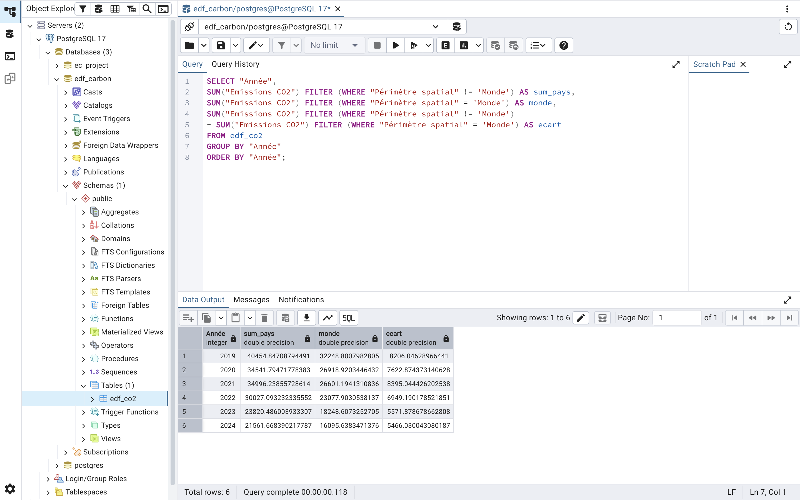
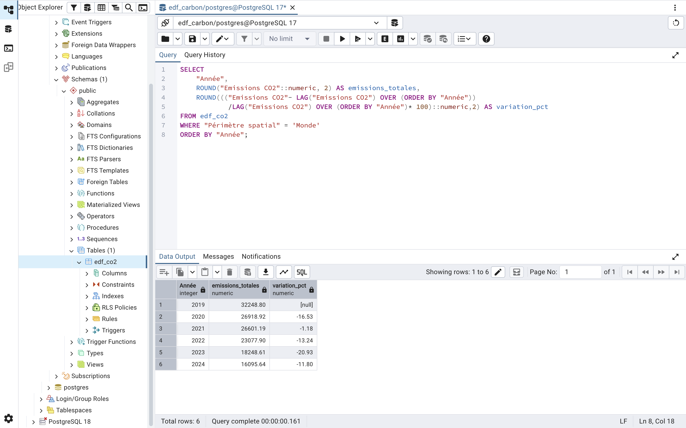
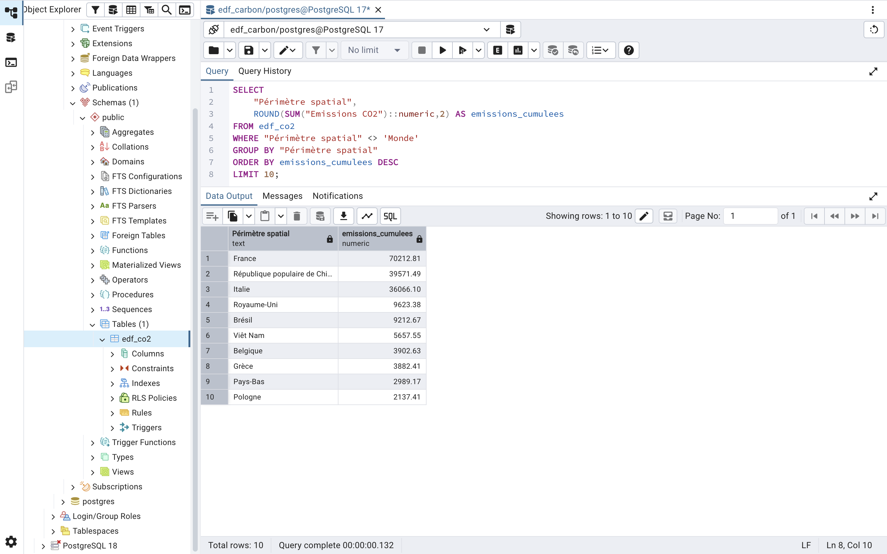
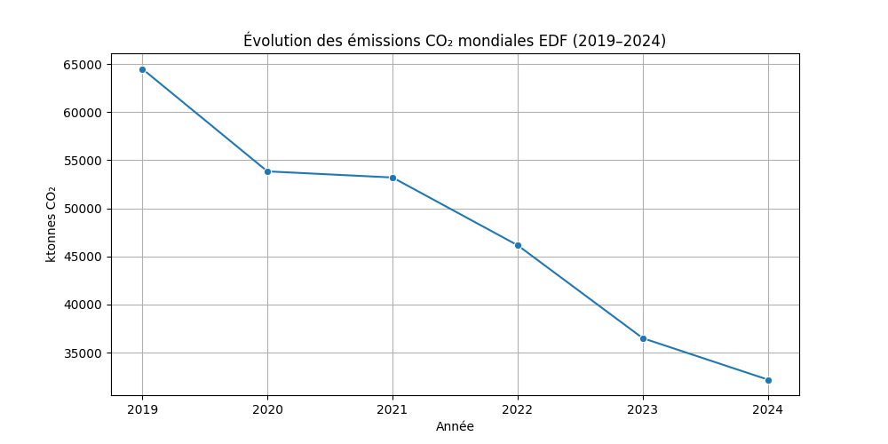
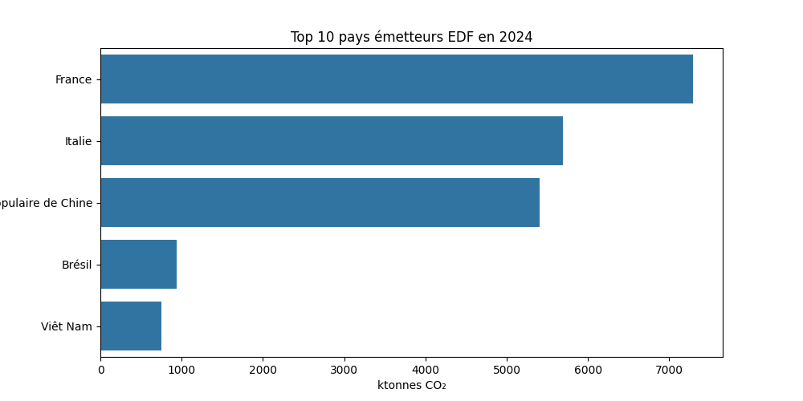
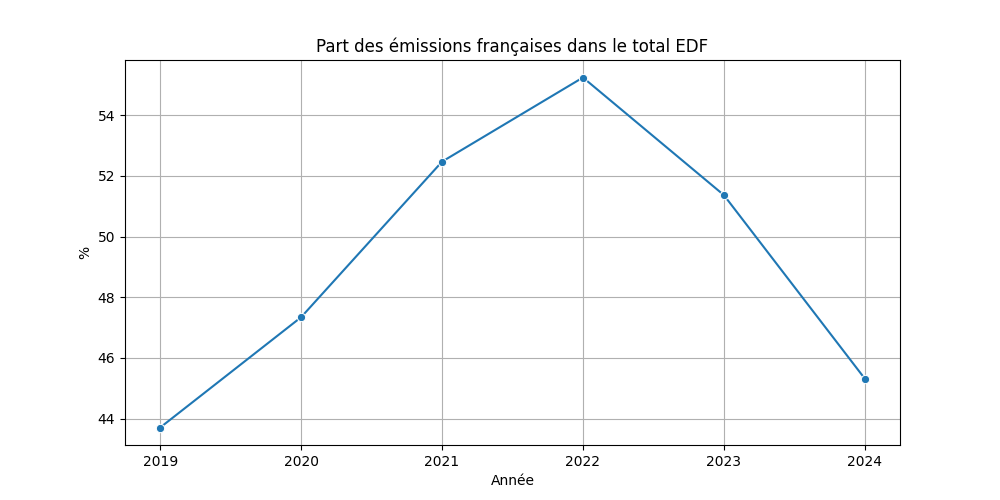
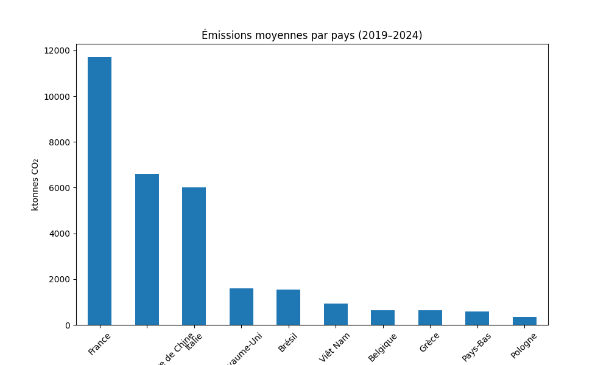
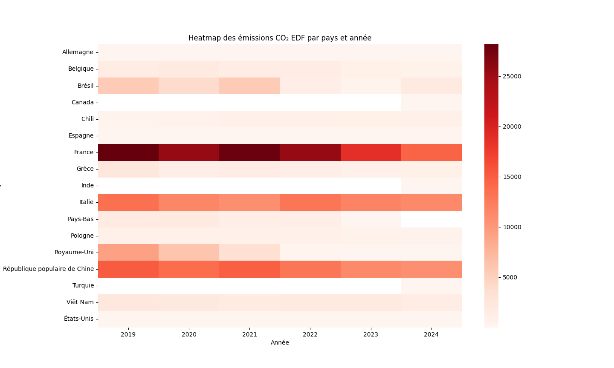

# EDF-Carbon-Analysis

# Analyse des émissions de CO₂ du groupe EDF (2019–2024)

Projet d’analyse des émissions de CO₂ du groupe EDF par pays et par année, basé sur des données Open Data.

## Synthèse

Ce projet analyse les émissions de CO₂ du groupe EDF sur la période 2019–2024 afin d’identifier les dynamiques de réduction carbone, la répartition géographique des émissions et les principaux contributeurs.

### Résultats clés
- Les émissions totales d’EDF diminuent d’environ 48 % sur la période 2019–2024
- La France représente en moyenne 40 à 45 % des émissions totales du groupe
- Les émissions sont fortement concentrées sur un nombre limité de pays
- Une accélération de la baisse est observée à partir de 2022
- La trajectoire globale suggère une transition progressive vers un mix énergétique moins carboné

---

## 1. Présentation du projet

### Objectif du projet

Ce projet a pour objectif de :

- Analyser les émissions de CO₂ du groupe EDF
- Identifier les pays les plus émetteurs
- Étudier l’évolution des émissions dans le temps

---

## 2. Technologies utilisées

| Outil | Utilisation |
|------|------------|
| PostgreSQL | Stockage et requêtes sur les données |
| SQL | Analyse et exploration des données |
| Python | Visualisation des données |
| GitHub | Versioning et portfolio |

---

## 3. Import et structuration des données

### Description des données

Source : Open Data EDF

Périmètre : émissions de CO₂ consolidées par pays

Période : 2019 → 2024

Unité : ktonnes CO₂

Niveau : groupe EDF (périmètre international)

### Base de données

Les données ont été importées dans une base PostgreSQL avec la structure suivante :

```sql
CREATE TABLE edf_co2 (
    "Année" INT,
    "Périmètre juridique" TEXT,
    "Legal perimeter" TEXT,
    "Périmètre spatial" TEXT,
    "Spatial perimeter" TEXT,
    "Emissions CO2" FLOAT,
    "Unité" TEXT,
    "Méthode de consolidation" TEXT,
    "Consolidation method" TEXT
);

```

### Remarque sur le périmètre de consolidation

```sql
SELECT "Année",
SUM("Emissions CO2") FILTER (WHERE "Périmètre spatial" != 'Monde') AS sum_pays,
SUM("Emissions CO2") FILTER (WHERE "Périmètre spatial" = 'Monde') AS monde,
SUM("Emissions CO2") FILTER (WHERE "Périmètre spatial" != 'Monde')
- SUM("Emissions CO2") FILTER (WHERE "Périmètre spatial" = 'Monde') AS ecart FROM edf_co2
GROUP BY "Année"
ORDER BY "Année";
```

Le périmètre “Monde” correspond à une consolidation en intégration globale des entités du groupe EDF.
Les données par pays correspondent à une ventilation géographique des émissions selon le périmètre disponible dans le jeu de données.
Ces deux niveaux de données étant construits selon des logiques différentes, ils ne constituent pas une décomposition strictement additive.



### Preuves d’exécution (PostgreSQL)

#### Création de la table


#### Import des données CSV


---

## 4. Nettoyage des données

### 4.1. Vérification des valeurs NULL

#### Objectif : Détecter les données manquantes. 
Cette vérification permet d’identifier les lignes incomplètes pouvant fausser les analyses statistiques et les agrégations SQL.

#### Requête SQL
Les données contiennent-elles des valeurs manquantes susceptibles de fausser les analyses ?
```sql
SELECT *
FROM edf_co2
WHERE "Emissions CO2" IS NULL
   OR "Année" IS NULL
   OR "Périmètre spatial" IS NULL;
```

#### Résultat


Aucune valeur NULL n’a été détectée dans les colonnes analysées.

#### Interprétation

Les données importées sont complètes et exploitables pour les analyses statistiques et temporelles.

### 4.2. Vérification des doublons

#### Objectif : Détecter des lignes importées plusieurs fois.
Cette analyse permet d’identifier d’éventuels doublons dans les données importées afin d’éviter une surestimation des émissions.

#### Requête SQL
Certaines lignes ont-elles été importées plusieurs fois dans la base de données ?
```sql
SELECT "Année",
       "Périmètre spatial",
       COUNT(*)
FROM edf_co2
GROUP BY "Année", "Périmètre spatial"
HAVING COUNT(*) > 1;
```

#### Résultat


Aucun doublon n’a été identifié dans les données.

#### Interprétation

Chaque combinaison année/périmètre spatial apparaît une seule fois dans la base, garantissant la cohérence des analyses.

### 4.3. Vérification des valeurs négatives

#### Objectif : Détecter des valeurs incohérentes.
Les émissions carbone étant des valeurs positives, cette vérification permet d’identifier d’éventuelles erreurs de saisie ou anomalies dans les données.

#### Requête SQL
Existe-t-il des valeurs d’émissions incohérentes ou négatives dans les données ?
```sql
SELECT *
FROM edf_co2
WHERE "Emissions CO2" < 0;
```

#### Résultat


Aucune valeur négative n’a été détectée.

#### Interprétation

Les données d’émissions carbone présentent des valeurs cohérentes et compatibles avec les analyses environnementales réalisées.

### 4.4. Vérification des années disponibles

#### Objectif : Contrôler la période étudiée.
Cette vérification confirme que les données couvrent correctement la période d’étude 2019–2024.

#### Requête SQL
Les données couvrent-elles correctement toute la période d’étude 2019–2024 ?
```sql
SELECT DISTINCT "Année"
FROM edf_co2
ORDER BY "Année";
```

#### Résultat


Les données couvrent bien l’ensemble de la période 2019–2024.

#### Interprétation

La continuité temporelle des données permet de réaliser des analyses d’évolution fiables sur plusieurs années.

### 4.5. Vérification des unités

#### Objectif : S’assurer que toutes les émissions utilisent la même unité.
Cette étape permet de vérifier l’homogénéité des unités de mesure afin d’assurer la cohérence des comparaisons entre pays et années.

##### Requête SQL
Toutes les émissions sont-elles exprimées dans la même unité de mesure ?
```sql
SELECT DISTINCT "Unité"
FROM edf_co2;
```
#### Résultat


Toutes les données sont exprimées en ktonnes.

#### Interprétation

L’uniformité des unités garantit la cohérence des comparaisons entre pays et années.

### 4.6. Vérification des valeurs extrêmes

#### Objectif : Identifier des émissions anormalement élevées.
Cette analyse permet de repérer les périmètres géographiques les plus fortement émetteurs ainsi que d’éventuelles anomalies statistiques.

#### Requête SQL
Quels sont les périmètres géographiques présentant les émissions les plus élevées ?
```sql
SELECT *
FROM edf_co2
ORDER BY "Emissions CO2" DESC
LIMIT 10;
```

#### Résultat

Les valeurs les plus élevées correspondent principalement au périmètre mondial (Monde) et à la France par la suite.
Les émissions mondiales diminuent progressivement entre 2019 et 2024.

#### Interprétation


Les valeurs observées restent cohérentes avec le périmètre étudié et mettent en évidence le poids du périmètre mondial dans les émissions du groupe EDF, ainsi qu’une tendance globale à la réduction des émissions carbone sur la période analysée.

### 4.7. Vérification des périmètres spatiaux

#### Objectif : Identifier les incohérences de nommage.
Les différentes valeurs du champ "Périmètre spatial" ont été contrôlées afin d’identifier d’éventuelles incohérences de nommage.

#### Requête SQL
Existe-t-il des incohérences de nommage dans les pays ou périmètres spatiaux ?
```sql
SELECT DISTINCT "Périmètre spatial"
FROM edf_co2
ORDER BY "Périmètre spatial";
```

#### Incohérences détectées


Une anomalie de nommage a été identifiée concernant la Chine. Nous avons République populaire de Chine et République Populaire de Chine (différence causée par une majuscule "P"). Ces deux valeurs représentaient le même pays mais étaient interprétées comme deux catégories différentes par PostgreSQL.
Cela peut entraîner des doublons dans les analyses, des moyennes incorrectes et des erreurs dans les classements des pays émetteurs.

#### Correction appliquée


Une opération de normalisation des données a été réalisée afin d’unifier les libellés.

```sql
UPDATE edf_co2
SET "Périmètre spatial" = 'République populaire de Chine'
WHERE "Périmètre spatial" = 'République Populaire de Chine';
```

#### Vérification après correction

Une nouvelle vérification des valeurs distinctes a été effectuée afin de confirmer la cohérence des données.

```sql
SELECT DISTINCT "Périmètre spatial"
FROM edf_co2
ORDER BY "Périmètre spatial";
```


#### Conclusion

Cette étape de nettoyage a permis d’améliorer la qualité et la fiabilité des analyses réalisées dans le projet.
Elle illustre également l’importance de la préparation des données dans une démarche de data analyse appliquée aux données ESG et environnementales.

---

## 5. Analyses réalisées

### 5.1. Évolution des émissions mondiales
Analyse de l’évolution des émissions de CO₂ du périmètre mondial sur la période 2019–2024.

#### Requêtes SQL principales
Comment les émissions mondiales de CO₂ du groupe EDF évoluent-elles entre 2019 et 2024 ?
```sql
SELECT "Année",
       SUM("Emissions CO2") AS total_emissions
FROM edf_co2
WHERE "Périmètre spatial" = 'Monde'
GROUP BY "Année"
ORDER BY "Année";
```
#### Preuves d’exécution (PostgreSQL)


#### Interprétation des résultats

On observe une réduction progressive et continue des émissions de CO₂ sur l’ensemble de la période.

Cette évolution peut s’expliquer par des politiques de réduction des émissions et le renforcement des obligations de reporting carbone.

#### Conclusion

Sur la période 2019–2024, le périmètre mondial analysé montre une tendance claire à la baisse des émissions de CO₂, suggérant une amélioration progressive de la performance environnementale.

---

### 5.2. Top pays émetteurs (2024)
Identification des pays les plus émetteurs de CO₂ en 2024 (hors périmètre global).

### Requêtes SQL principales
Quels sont les pays les plus émetteurs de CO₂ en 2024 au sein du groupe EDF ?
```sql
SELECT "Périmètre spatial",
       "Emissions CO2"
FROM edf_co2
WHERE "Année" = 2024
AND "Périmètre spatial" != 'Monde'
ORDER BY "Emissions CO2" DESC;

```

#### Preuves d’exécution (PostgreSQL)


#### Interprétation des résultats

L’analyse des émissions de CO₂ du groupe EDF en 2024 met en évidence une forte concentration des émissions sur quelques pays clés.

La France apparaît comme le principal contributeur avec plus de 7 293 unités d’émissions, suivie par l’Italie et la Chine. Cette répartition reflète l’importance historique des activités du groupe EDF en Europe ainsi que sa présence internationale sur plusieurs marchés énergétiques.

Les émissions élevées observées en Italie et en Chine indiquent une contribution importante de ces pays aux émissions du groupe EDF. Les causes précises nécessiteraient des données opérationnelles complémentaires.

À l’inverse, certains pays comme le Royaume-Uni, le Canada ou l’Inde présentent des niveaux d’émissions très faibles dans le périmètre EDF, ce qui peut traduire une présence plus limitée du groupe, des activités moins intensives en carbone ou un portefeuille énergétique davantage orienté vers des énergies bas carbone.

#### Conclusion

Globalement, les résultats montrent que les émissions carbone du groupe EDF ne sont pas réparties uniformément entre les différents pays d’implantation. Quelques zones géographiques concentrent une part majeure des émissions totales du groupe.

### 5.3. France vs Monde
Comparaison des émissions de la France par rapport au total mondial afin d’analyser son poids relatif.

#### Requêtes SQL principales
Quelle part des émissions mondiales du groupe EDF est représentée par la France ?
```sql
WITH emissions AS (
    SELECT 
        "Année",
        MAX(CASE WHEN "Périmètre spatial" = 'France' 
            THEN "Emissions CO2" END) AS france,
        MAX(CASE WHEN "Périmètre spatial" = 'Monde' 
            THEN "Emissions CO2" END) AS monde
    FROM edf_co2
    GROUP BY "Année")

SELECT 
    "Année",
    ROUND(france::numeric,2) AS emissions_france,
    ROUND(monde::numeric,2) AS emissions_monde,
    ROUND((france / monde * 100)::numeric,2) AS poids_france_pct
FROM emissions
ORDER BY "Année";
```
#### Preuves d’exécution (PostgreSQL)


#### Interprétation des résultats

L’analyse comparative entre les émissions françaises et les émissions mondiales du groupe EDF met en évidence une diminution progressive des émissions de CO₂ sur l’ensemble de la période 2019–2024.

Les émissions mondiales du groupe passent d’environ 32 249 en 2019 à 16 096 en 2024, traduisant une réduction significative de l’empreinte carbone globale d’EDF. La France suit une tendance similaire avec une baisse des émissions passant de 14 094 à 7 294 sur la même période.
Malgré cette diminution, la France conserve un poids important dans les émissions totales du groupe. En moyenne, elle représente entre 40 % et 45 % des émissions mondiales d’EDF sur la période étudiée.

Cette concentration peut s’expliquer par l’importance historique du marché français pour EDF, la taille des infrastructures énergétiques nationales et la centralisation d’une partie importante des activités du groupe en France.

Les résultats suggèrent également qu’EDF a engagé une trajectoire globale de réduction carbone entre 2019 et 2024, potentiellement liée aux politiques de transition énergétique, à l’évolution du mix énergétique, à la fermeture progressive de certaines activités fortement émettrices ou à l’amélioration des performances environnementales.

### 5.4. Émissions moyennes par pays

#### Requêtes SQL principales
Quels pays présentent les émissions moyennes les plus élevées sur la période étudiée ?
```sql
SELECT "Périmètre spatial", AVG("Emissions CO2") 
FROM edf_co2
GROUP BY "Périmètre spatial"
ORDER BY AVG("Emissions CO2") DESC;

```
#### Preuves d’exécution (PostgreSQL)


### 5.5. Variations annuelles des émissions

#### Requêtes SQL principales
Quelles sont les variations annuelles des émissions de CO₂ du groupe EDF ?
```sql
SELECT 
    "Année",
    ROUND(SUM("Emissions CO2")::numeric,2) AS emissions_totales,

    ROUND(((SUM("Emissions CO2")
	        - LAG(SUM("Emissions CO2"))OVER (ORDER BY "Année"))
			/LAG(SUM("Emissions CO2"))OVER (ORDER BY "Année"))::numeric * 100,2) AS variation_pct
FROM edf_co2
GROUP BY "Année"
ORDER BY "Année";
```

#### Preuves d’exécution (PostgreSQL)


#### Interprétation des résultats

L’analyse de l’évolution des émissions de CO₂ du groupe EDF entre 2019 et 2024 met en évidence une tendance globale fortement baissière, avec une réduction d’environ 48 % sur la période étudiée.
Cette diminution n’est pas linéaire. Après une forte baisse entre 2019 et 2020, les émissions se stabilisent légèrement en 2021 avant de reprendre une trajectoire descendante plus marquée à partir de 2022.
L’année 2023 constitue le point le plus significatif de cette dynamique avec une baisse de près de 21 %, traduisant une accélération des efforts de réduction des émissions.
En 2024, la baisse se poursuit mais à un rythme plus modéré, suggérant une phase de consolidation des gains environnementaux.

#### Conclusion
Sur la période étudiée, EDF présente une trajectoire de réduction carbone nette et structurée, avec une accélération des efforts à partir de 2022. Cette évolution peut être interprétée comme le résultat combiné de politiques de transition énergétique, d’optimisation des opérations et de transformation progressive du mix énergétique du groupe.

### 5.6. Top 10 des pays les plus émetteurs sur la période 2019–2024 (émissions cumulées)

#### Requêtes SQL principales
Quels pays concentrent le plus d’émissions cumulées sur l’ensemble de la période 2019–2024 ?
```sql
SELECT "Périmètre spatial", SUM("Emissions CO2")
FROM edf_co2
GROUP BY "Périmètre spatial"
ORDER BY SUM("Emissions CO2") DESC
LIMIT 10;
```
#### Preuves d’exécution (PostgreSQL)


---

## 6. Visualisations Python

Cette section présente l’exploitation des données via Python afin de compléter les analyses SQL avec des visualisations dynamiques et une analyse exploratoire des émissions de CO₂ du groupe EDF.

### 6.1. Stack Python utilisée

| Outil | Utilisation |
|------|------------|
| Pandas | Manipulation et agrégation des données |
| Matplotlib | Visualisation des tendances |
| Seaborn | Graphiques statistiques avancés |

### 6.2. Chargement des données (CSV)

À l'issue des opérations de nettoyage et de normalisation réalisées sous PostgreSQL (contrôle des valeurs manquantes, des doublons, des incohérences de nommage et des valeurs aberrantes), la table finale a été exportée au format CSV. Ce fichier nettoyé a ensuite été utilisé dans Python afin de réaliser les visualisations et analyses exploratoires présentées dans cette section.

```python
import pandas as pd

df = pd.read_csv("emissions-de-co2-consolidees-par-pays-du-groupe-edf.csv")

print(df.head())
print(df.columns)
```
Objectif : vérifier que les données sont correctement chargées et comprendre la structure du dataset.

### 6.3. Évolution des émissions mondiales (2019–2024)

```python
import matplotlib.pyplot as plt
import seaborn as sns

world = df[df["Périmètre spatial"] == "Monde"]

world_yearly = world.groupby("Année")["Emissions CO2"].sum().reset_index()

plt.figure(figsize=(10,5))
sns.lineplot(data=world_yearly, x="Année", y="Emissions CO2", marker="o")

plt.title("Évolution des émissions CO₂ mondiales EDF (2019–2024)")
plt.ylabel("ktonnes CO₂")
plt.xlabel("Année")
plt.grid(True)
plt.show()
```
Objectif : Cette visualisation met en évidence la tendance globale à la baisse des émissions sur la période étudiée.


### 6.4. Top pays émetteurs en 2024

```python
df_2024 = df[(df["Année"] == 2024) & (df["Périmètre spatial"] != "Monde")]

top_countries = df_2024.sort_values("Emissions CO2", ascending=False).head(10)

plt.figure(figsize=(10,5))
sns.barplot(data=top_countries, y="Périmètre spatial", x="Emissions CO2")

plt.title("Top 10 pays émetteurs EDF en 2024")
plt.xlabel("ktonnes CO₂")
plt.ylabel("")
plt.show()
```
Objectif : Cette analyse montre la concentration des émissions sur un nombre limité de pays.


### 6.5. Part de la France dans les émissions mondiales

```python
fr_world = df[df["Périmètre spatial"].isin(["France", "Monde"])]

pivot = fr_world.pivot_table(
    index="Année",
    columns="Périmètre spatial",
    values="Emissions CO2"
).reset_index()

pivot["Part France (%)"] = (pivot["France"] / pivot["Monde"]) * 100

plt.figure(figsize=(10,5))
sns.lineplot(data=pivot, x="Année", y="Part France (%)", marker="o")

plt.title("Part des émissions françaises dans le total EDF")
plt.ylabel("%")
plt.xlabel("Année")
plt.grid(True)
plt.show()
```

Objectif : Cette visualisation permet d’observer la stabilité du poids de la France dans les émissions globales du groupe EDF.


### 6.6. Répartition des émissions par pays (moyenne 2019–2024)

```python
avg_country = (
    df[df["Périmètre spatial"] != "Monde"]
    .groupby("Périmètre spatial")["Emissions CO2"]
    .mean()
    .sort_values(ascending=False)
    .head(10))

plt.figure(figsize=(10,6))
avg_country.plot(kind="bar")

plt.title("Émissions moyennes par pays (2019–2024)")
plt.ylabel("ktonnes CO₂")
plt.xlabel("")
plt.xticks(rotation=45)
plt.show()
```
Objectif : Cette analyse met en évidence les pays structurellement les plus émetteurs sur la période.


### 6.7. Heatmap des émissions par pays et année

```python
pivot_heatmap = df[df["Périmètre spatial"] != "Monde"].pivot_table(
    index="Périmètre spatial",
    columns="Année",
    values="Emissions CO2",
    aggfunc="sum")

plt.figure(figsize=(12,8))
sns.heatmap(pivot_heatmap, cmap="Reds")

plt.title("Heatmap des émissions CO₂ EDF par pays et année")
plt.xlabel("Année")
plt.ylabel("Pays")
plt.show()
```
Objectif : Cette heatmap permet de visualiser rapidement les zones géographiques les plus intensives en émissions.


### 7. Export des résultats analytiques

```python
world_yearly.to_csv("world_emissions_trend.csv", index=False)
top_countries.to_csv("top_countries_2024.csv", index=False)
```
Objectif : sauvegarder les résultats pour une réutilisation ou un dashboard.

---

## 7. Conclusion générale

Ce projet d’analyse des émissions carbone du groupe EDF met en évidence une tendance globale à la réduction des émissions de CO₂ entre 2019 et 2024.

Les analyses réalisées montrent que les émissions sont fortement concentrées sur quelques pays clés, la France représente une part importante des émissions totales du groupe et que les émissions mondiales suivent une trajectoire baissière progressive sur la période étudiée.

Ce projet illustre également l’utilisation combinée de PostgreSQL, SQL et Python dans une démarche complète de data analyse appliquée aux enjeux ESG et climatiques.

Au-delà des résultats techniques, cette étude permet de mieux comprendre la répartition géographique des émissions carbone et les dynamiques de transition énergétique au sein d’un grand groupe international.
